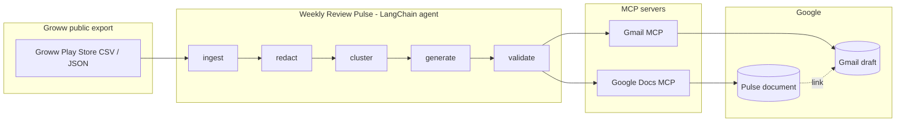
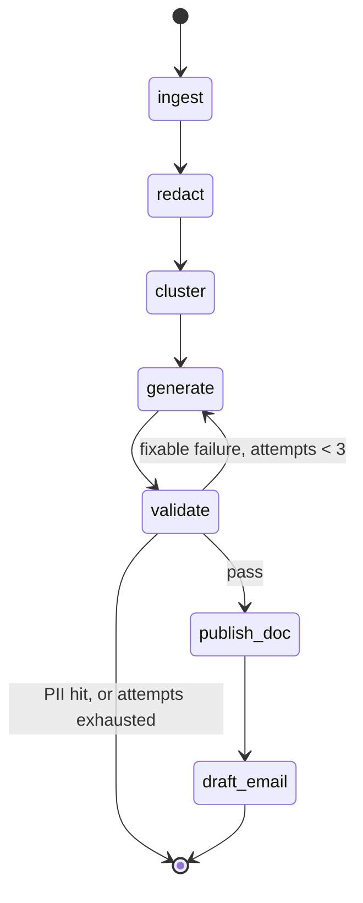

# Architecture — Weekly Review Pulse

Weekly Review Pulse turns a public **Groww** Play Store review export into a one-page weekly note, publishes that note to **Google Docs**, and files a **Gmail draft** to you or an alias. **The AI agent is built with LangChain** (prompts, structured output, and MCP tool binding). **LangGraph is recommended** to orchestrate the staged pipeline (retry / abort edges); a thin Python runner calling LangChain chains in order is also acceptable if it preserves the same stage contracts. Google auth and HTTP stay entirely on **MCP servers** — this project never owns an OAuth client or a Google REST client.

**Product:** Groww (`com.nextbillion.groww`)  
**Play Store listing:** https://play.google.com/store/apps/details?id=com.nextbillion.groww&hl=en_IN

**Scope note (same as `docs/problemStatement.md`):** App Store reviews are out of scope. Ingest Groww Play Store **exports** only — do not ingest, cluster, or quote iOS / App Store data, and **do not scrape** the Play Store listing page.

**Contents**

1. [Purpose and scope](#1-purpose-and-scope)
2. [Design principles](#2-design-principles)
3. [Tech stack](#3-tech-stack)
4. [System context](#4-system-context)
5. [Pipeline overview](#5-pipeline-overview)
6. [Time windows: weekly note from a 12-week corpus](#6-time-windows-weekly-note-from-a-12-week-corpus)
7. [LangChain agent design](#7-langchain-agent-design)
8. [Repository layout](#8-repository-layout)
9. [Configuration](#9-configuration)
10. [Data model](#10-data-model)
11. [Stage specifications](#11-stage-specifications)
12. [Worked example](#12-worked-example)
13. [Constraint enforcement](#13-constraint-enforcement)
14. [Error handling](#14-error-handling)
15. [Privacy and security](#15-privacy-and-security)
16. [Testing](#16-testing)
17. [Observability](#17-observability)
18. [Audience fit](#18-audience-fit)
19. [Definition of done](#19-definition-of-done)

---

## 1. Purpose and scope

**Purpose.** Give Product/Growth, Support, and Leadership a weekly pulse they can read in minutes: what users care about, what they actually said, and what to do next.

### In scope

- Import a public **Groww** Play Store review export covering the last 8–12 weeks (no App Store; no scraping of the Groww listing).
- Normalize, window by date, and strip PII.
- Build the weekly-pulse **AI agent with LangChain** (structured output for cluster/generate + MCP tools for Docs/Gmail). Phase-5 **orchestration** (validate → retry / abort / publish) may use **LangGraph** or a **Python runner** — LangGraph is optional.
- Cluster reviews into **at most 5 themes**.
- Write a one-page weekly note: top 3 themes, 3 verbatim quotes, 3 action ideas, **≤250 words**.
- Create or update the note in Google Docs via MCP.
- Create a Gmail draft containing the note or a clear pointer to the Doc.

### Out of scope

- **App Store / iOS reviews** in any form.
- Scraping store pages, developer-console logins, or other ToS-violating automation.
- Direct Google Docs / Gmail REST calls or a bespoke OAuth flow.
- User accounts or multi-tenant auth. A static dashboard and hosted API/scheduler may exist for ops; they are not a product SaaS.
- Invented quotes, reviewer identities, or device-level telemetry.

### Where Groww reviews come from

The operator supplies a **local** Groww export under `data/exports/`. The listing URL identifies the product; it is **not** a download endpoint for this pipeline.

| Source | Notes |
| --- | --- |
| Google Play Console → Ratings → Reviews → Download CSV for Groww | Preferred if you have publisher access to `com.nextbillion.groww`. |
| A public review dataset filtered to Groww / this package id | Fine for coursework; treat schema as untrusted and map columns. |
| A colleague's exported Groww CSV/JSON | Same handling; PII rules still apply. |

Not acceptable: scraping https://play.google.com/store/apps/details?id=com.nextbillion.groww&hl=en_IN, automating a logged-in console session, or any undocumented store API.

---

## 2. Design principles

| Principle | Implication |
| --- | --- |
| Play Store only | Ingest accepts Groww Play-shaped exports; App Store files are skipped and reported. |
| LangChain agent | **LangChain is the framework for this AI agent** — clustering, pulse writing, and MCP tool calls. Prefer LangGraph for staged orchestration; do not use ad-hoc one-off LLM scripts as the primary path. |
| MCP-first Google | Docs and Gmail are reached only through MCP tools bound into LangChain. No Google client libraries. |
| Deterministic where possible | Ingest, redaction, ranking, word counting, and validation are plain Python. The LLM handles clustering and prose only. |
| Fail closed on privacy | A PII scan runs on the finished note. A hit aborts the run before anything leaves the machine. |
| Verbatim quotes | Every quote must be an exact substring of redacted review text, verified in code, not trusted from the model. |
| Bounded synthesis | ≤5 themes, exactly 3 highlighted, exactly 3 quotes, exactly 3 actions, ≤250 body words. |
| File-backed stages | Each stage writes an artifact, so a failed Google call never forces a re-cluster. |
| Auditable | Themes carry `review_ids`; quotes carry their source `review_id`. Every claim traces back to a row. |

---

## 3. Tech stack

Weekly Review Pulse is split into a **pipeline + API backend** and a **static dashboard frontend**. Google Docs/Gmail stay on an external **MCP** server; this repo does not embed Google OAuth or REST clients.

### 3.1 Backend

| Layer | Choice | Role |
| --- | --- | --- |
| Language / runtime | **Python 3.12** | Pipeline, validation, stdlib HTTP server |
| Agent framework | **LangChain** (`langchain-core`) | Prompts, structured output for cluster/generate |
| Orchestration | **LangGraph** (optional) or Python runner | Generate → validate → retry / abort / publish |
| Chat model | **Groq** via `langchain-groq` | Default model from `PULSE_MODEL` (e.g. `openai/gpt-oss-120b`) |
| MCP tools | `langchain-mcp-adapters` | Bind Docs append + Gmail **draft** tools only |
| Schemas / config | **Pydantic v2**, **PyYAML**, **python-dotenv** | Contracts, `config.yaml`, `.env` |
| Review fetch (ops) | `google-play-scraper` | Optional public Play scrape into `data/exports/` |
| Language filter | `langdetect` | Drop non-English rows at ingest |
| HTTP API | **stdlib** `http.server` (`src/web.py`) | `/api/health`, `/api/weeks`, `/api/pulse`, `/api/meta` |
| Hosting (API) | **Railway** + Docker (`Dockerfile`, `requirements-app.txt`) | Backend-only serve; slim image without LangChain for the read API |
| Weekly job | **GitHub Actions** (+ local `scripts/run_weekly_pulse.py`) | Monday 09:00 IST cron |

**Dependency split**

| File | Used for |
| --- | --- |
| `requirements.txt` | Full pipeline (Actions / local `python -m src`) |
| `requirements-app.txt` | Railway API image (Pydantic / YAML / dotenv only) |

### 3.2 Frontend

| Layer | Choice | Role |
| --- | --- | --- |
| UI | **Static HTML / CSS / JS** under `frontend/` | Stitch-style Groww Weekly Review Pulse dashboard |
| Styling | **Tailwind CSS** (CDN) + custom CSS variables | Layout, tokens, responsive UI |
| Fonts | **Lora** + **DM Sans** (Google Fonts), Material Symbols | Display / body / icons |
| Data | `fetch` to same-origin `/api/*` | Pulse JSON, weeks list, markdown download |
| Share | Gmail compose URL (+ mailto / clipboard fallback) | Opens a draft; does not call Gmail API from the browser |
| Hosting | **Vercel** (Root Directory = `frontend`) | Static deploy |
| API proxy | `frontend/vercel.json` rewrites | `/api/:path*` → Railway backend |

The dashboard is a **read/share UI** over artifacts already produced by the backend pipeline. It does not run cluster/generate in the browser.

### 3.3 External systems

| System | Role |
| --- | --- |
| Groq | LLM inference for cluster + generate |
| Railway Google Workspace MCP | `append_to_google_doc`, `create_email_draft` |
| Google Docs / Gmail | Destination of publish (draft only; never auto-send) |

LangChain package detail and graph shape remain in [§7](#7-langchain-agent-design).

---

## 4. System context



**Actors**

- **Operator** — supplies the export, runs the agent, later sends the draft by hand.
- **Agent** — LangChain for cluster/generate/MCP tools; orchestrated by LangGraph **or** a Python runner. The only component that calls MCP tools.
- **Stakeholders** — read the Doc; receive the email only if a human sends it.

---

## 5. Pipeline overview

A linear batch pipeline of five processing stages and two publish steps.

```
exports/ → ingest → redact → cluster → generate → validate → publish_doc → draft_email
              │        │        │          │          │
              └────────┴────────┴──────────┴──────────┴──→ data/artifacts/
```

| # | Stage | Responsibility | Output | Kind |
| --- | --- | --- | --- | --- |
| 1 | `ingest` | Load export, map columns, apply 12-week window, dedupe | `reviews.normalized.json` | Deterministic |
| 2 | `redact` | Strip PII from text/title, drop identity columns | `reviews.redacted.json` | Deterministic |
| 3 | `cluster` | Assign reviews to ≤5 themes, rank them | `themes.json` | LLM (structured) |
| 4 | `generate` | Write the pulse: 3 themes, 3 quotes, 3 actions | `pulse.json`, `pulse.md` | LLM (structured) |
| 5 | `validate` | Word count, quote provenance, PII scan, schema | `validation.json` | Deterministic |
| 6 | `publish_doc` | Create or update the Google Doc | `doc_url` | MCP tool |
| 7 | `draft_email` | Create the Gmail draft | `draft_id` | MCP tool |

`validate` sits between generation and publishing so nothing unverified reaches Google.

---

## 6. Time windows: weekly note from a 12-week corpus

The assignment asks for a 8–12 week import but a **weekly** note. These serve different purposes, and the distinction drives most of the logic:

| Window | Span | Used for |
| --- | --- | --- |
| **Corpus** | `week_ending − 12 weeks` → `week_ending` | Discovering stable themes and computing a baseline rate per theme |
| **Reporting week** | `week_ending − 6 days` → `week_ending` | Everything printed in the note: counts, quotes, ranking |

Clustering runs over the **full corpus** so theme definitions stay stable week to week; the note reports only the **reporting week**, with a trend arrow computed against the prior 11 weeks.

**Trend** per theme, where `w` = reporting-week count and `b` = mean weekly count over the prior 11 weeks:

| Condition | Symbol |
| --- | --- |
| `w ≥ 1.25 × b` | `↑ rising` |
| `w ≤ 0.75 × b` | `↓ falling` |
| otherwise | `→ steady` |

**Thin-week fallback.** If the reporting week holds fewer than `min_week_reviews` (default 15) reviews, widen the reporting window to the trailing 4 weeks and set `pulse.window_note = "4-week rollup (low weekly volume)"`. The note must state the window it actually used — never silently label a 4-week rollup as a week.

`week_ending` defaults to the most recent date present in the export, not today's date, so a stale export produces an honestly-labelled note.

---

## 7. LangChain agent design

**Yes — LangChain is used to build this AI agent.** It owns the model-facing work: prompt templates, structured outputs for themes and the pulse, and binding Docs/Gmail MCP servers as tools. That is enough to implement the “agent” parts of the problem statement.

### 7.0 What needs orchestration (and why that is not “LangGraph required”)

After LangChain writes the pulse, the run still must:

1. **Validate** — word limit, theme/quote/action counts, verbatim quotes, store purity, PII scan.
2. **Retry** — call generate again only when the failure is fixable and attempts remain (default max 3).
3. **Abort** — on PII (or non-fixable errors): no retry, no Docs/Gmail publish.
4. **Publish only on pass** — Docs MCP then Gmail draft.

That is **control flow + shared state**, not another LLM skill. **LangGraph is one clean way to encode it** (nodes and conditional edges). **It is not mandatory:** a small Python loop around the same LangChain `generate` / `validate` functions is equally valid if it preserves those rules.

```text
pulse = generate(...)
while not validate(pulse).passed:
    if not fixable or attempts >= 3: abort  # keep artifacts; do not publish
    pulse = generate(... with failure codes ...)
publish_doc(...); draft_email(...)
```

**LangGraph** (optional but recommended in this repo) can sit on top of LangChain as a state machine: fixed stage order, shared `PulseState`, capped `validate → generate` retries, hard abort on PII. If you skip LangGraph, use the runner pattern above.

### 7.1 Why LangChain fits

The work is a fixed sequence of typed steps with two external tools — not a conversational assistant. LangChain supplies exactly the pieces needed for the agent:

| Need | Capability |
| --- | --- |
| Theme + pulse JSON | LangChain **`with_structured_output(...)`** against Pydantic models in §10 |
| Prompt control | LangChain **prompt templates** for cluster and pulse (word limit, verbatim quotes, ≤5 themes) |
| Docs + Gmail | LangChain **tools** via **`langchain-mcp-adapters`** (MCP-first; no Google REST) |
| Staged weekly job (optional graph) | **LangGraph** on LangChain: one node per stage, shared state, conditional retry |
| Self-correction | Conditional edge (LangGraph) **or** a LangChain retry loop in Python on fixable validate failures |

### 7.2 LangChain packages

Product-level frontend/backend stack is in [§3](#3-tech-stack). Agent packages:

| Package | Role |
| --- | --- |
| `langchain-core` | Prompts, runnables, output parsers |
| `langgraph` | Pipeline graph, state, conditional retry edge |
| `langchain-groq` | Chat model for `cluster` and `generate` (Groq) |
| `langchain-mcp-adapters` | Load Docs and Gmail MCP tools as LangChain tools |
| `pydantic` | `Review`, `Theme`, `Pulse` contracts |
| `pandas` (optional) | CSV loading and date filtering |

The chat provider is an implementation choice; nothing in this design depends on a specific vendor.

### 7.3 Orchestration graph (LangGraph — optional, recommended)

**Phase-5 need = orchestration, not LangGraph itself.** When you choose LangGraph, the weekly job looks like this:



The retry edge is **conditional and capped** (§14). A PII failure never retries — it aborts. Without LangGraph, enforce the same transitions in a Python runner around the LangChain chains.

### 7.4 State

`PulseState` (shared run state — LangGraph `TypedDict` **or** plain dict/object in a Python runner), mirrored to `data/artifacts/` after each stage so any step can be rerun in isolation:

| Field | Set by | Type |
| --- | --- | --- |
| `export_paths` | operator | `list[str]` |
| `week_ending` | ingest | `date` |
| `reviews_normalized` | ingest | `list[Review]` |
| `ingest_report` | ingest | `dict` |
| `reviews_redacted` | redact | `list[Review]` |
| `themes` | cluster | `list[Theme]` |
| `pulse` | generate | `Pulse` |
| `validation` | validate | `ValidationResult` |
| `attempts` | validate | `int` |
| `doc_url` | publish_doc | `str \| None` |
| `draft_id` | draft_email | `str \| None` |

### 7.5 Node types

- **Deterministic** — `ingest`, `redact`, `validate`. Pure Python, no model call, fully unit-testable.
- **LLM** — `cluster`, `generate`. Structured output only; prompts live in `prompts/`.
- **Tool** — `publish_doc`, `draft_email`. Invoke MCP tools loaded through the adapter.

This is deliberately **not** a free-form ReAct agent. Whether you use LangGraph nodes or a LangChain + Python runner, the theme cap, word limit, and PII gate must be enforced in code — not left to the model to “remember.”

### 7.6 MCP binding

```text
Orchestrator (LangGraph tool node OR Python calling LangChain tools)
  └── langchain-mcp-adapters  (load_mcp_tools)
        ├── Google Docs MCP server ──┐
        └── Gmail MCP server ────────┴──→ Google  (OAuth lives here, not in this repo)
```

Tool names vary by server, so `src/publish.py` resolves them at startup by matching capability rather than hardcoding a name:

| Capability needed | Match on | Fallback |
| --- | --- | --- |
| Create document | tool name containing `create` + `doc` | Fail with the list of available tools |
| Update / append document | `update`, `insert`, or `append` + `doc` | Create a fresh doc instead |
| Create mail draft | `draft` + (`gmail` or `mail`) | Hard fail — the draft is a required deliverable |

If no MCP adapter package is available, bind the MCP tools the environment already exposes to the agent. **Never** substitute a Google API client to work around a missing tool.

---

## 8. Repository layout

```
M3-9/
  docs/
    problemStatement.md
    architecture.md
  config.yaml                    # windows, theme seeds, recipient, doc title
  .env.example                   # model + MCP settings (never commit .env)
  requirements.txt
  data/
    exports/                     # Groww Play Store exports (gitignored)
    artifacts/                   # per-run outputs (gitignored)
    state/
      doc_registry.json          # week_ending -> document id  (committed empty)
  prompts/
    cluster.md
    pulse.md
  src/
    __main__.py                  # entry point: python -m src
    config.py                    # load config.yaml + .env
    schemas.py                   # Review, Theme, Pulse, ValidationResult
    ingest.py
    redact.py
    cluster.py                   # LangChain structured-output chain
    generate.py                  # LangChain pulse chain
    validate.py                  # word count, provenance, PII gate
    publish.py                   # MCP tool resolution and calls
    render.py                    # Pulse -> markdown
    agent/
      state.py
      nodes.py
      graph.py
  tests/
    fixtures/play_reviews_sample.csv
    test_ingest.py
    test_redact.py
    test_validate.py
    test_render.py
```

---

## 9. Configuration

Behavioural knobs live in `config.yaml`; secrets live in `.env`. Nothing that affects output is hardcoded in a module.

```yaml
product_name: "Groww"
package_id: "com.nextbillion.groww"
play_store_url: "https://play.google.com/store/apps/details?id=com.nextbillion.groww&hl=en_IN"

windows:
  corpus_weeks: 12
  reporting_days: 7
  min_week_reviews: 15          # below this, roll up to 4 weeks
  fallback_days: 28

themes:
  max_total: 5                  # hard cap from the problem statement
  highlight: 3
  seeds:                        # Groww-oriented
    - { id: onboarding, label: "Onboarding & demat" }
    - { id: kyc,        label: "KYC & verification" }
    - { id: payments,   label: "Payments & UPI" }
    - { id: trading,    label: "Trading & orders" }
    - { id: withdrawals,label: "Withdrawals & payouts" }

note:
  max_words: 250
  quote_count: 3
  action_count: 3
  quote_min_chars: 40
  quote_max_chars: 200

delivery:
  recipient: "me+pulse@example.com"
  doc_title: "Weekly Review Pulse — Groww — {week_ending}"
  email_subject: "Weekly Review Pulse — Groww — {week_ending}"
  email_body_mode: "full_note_plus_link"   # full_note_plus_link | link_only

limits:
  cluster_batch_size: 25
  cluster_max_attempts: 2
  generate_max_attempts: 3
```

`.env.example`

```dotenv
OPENAI_API_KEY=
PULSE_MODEL=gpt-4o-mini
DOCS_MCP_SERVER=google-docs
GMAIL_MCP_SERVER=gmail
LANGSMITH_TRACING=false
LANGSMITH_API_KEY=
```

Note the seed list has 5 entries and `max_total` is 5, so `other` can only appear by displacing a seed. Ship 4 seeds if you want room for a catch-all.

---

## 10. Data model

### 10.1 Review

One row of the export after ingest.

| Field | Type | Notes |
| --- | --- | --- |
| `id` | `str` | SHA-1 of `date + rating + title + text`, truncated to 12 chars. Never derived from a username. |
| `store` | `Literal["play_store"]` | Kept as a single-value enum for forward compatibility if another store is added later. |
| `date` | `date` | Drives both windows in §6. |
| `rating` | `int \| None` | 1–5 when the export provides it. |
| `title` | `str` | Play Console exports include a review title; it is often blank. |
| `text` | `str` | Required. Rows with empty text are dropped. |
| `app_version` | `str \| None` | Optional, not PII. |

**Never persisted:** reviewer name, reviewer profile URL, email, user ID, device ID, IP, or any other identity-bearing column. These are dropped during column mapping, before the first artifact is written.

### 10.2 Theme

| Field | Type | Notes |
| --- | --- | --- |
| `id` | `str` | Slug, e.g. `payments`. |
| `label` | `str` | Display name. |
| `description` | `str` | One sentence defining the bucket. |
| `review_ids` | `list[str]` | All corpus members — the audit trail. |
| `count_corpus` | `int` | Members across 12 weeks. |
| `count_week` | `int` | Members inside the reporting window. |
| `avg_rating_week` | `float \| None` | Mean rating for the reporting week. |
| `baseline_weekly` | `float` | Mean weekly count over the prior 11 weeks. |
| `trend` | `"rising" \| "falling" \| "steady"` | Per §6. |

Hard cap: **5 themes total**, including `other` if present.

**Ranking (fully determined, no ties).** Sort by:

1. `count_week` descending — volume is the headline signal.
2. `avg_rating_week` ascending — at equal volume, the more painful theme leads.
3. `id` alphabetically — guarantees byte-identical output across reruns.

`other` is excluded from the top 3 unless fewer than 3 real themes exist.

### 10.3 Pulse

```json
{
  "product_name": "Groww",
  "week_ending": "2026-08-30",
  "corpus_window": { "from": "2026-06-08", "to": "2026-08-30" },
  "reporting_window": { "from": "2026-08-24", "to": "2026-08-30" },
  "window_note": null,
  "review_count_week": 87,
  "review_count_corpus": 1042,
  "avg_rating_week": 3.4,
  "store": "play_store",
  "top_themes": [
    {
      "id": "payments",
      "label": "Payments & UPI",
      "count_week": 31,
      "avg_rating_week": 2.1,
      "trend": "rising",
      "summary": "UPI and net-banking add-money flows fail after debit, leaving funds blocked."
    }
  ],
  "quotes": [
    {
      "text": "Money left my account but the app says payment failed.",
      "review_id": "a1b2c3d4e5f6",
      "theme_id": "payments",
      "rating": 1,
      "date": "2026-08-27"
    }
  ],
  "actions": [
    {
      "title": "Add idempotent payment retry",
      "detail": "Reconcile debited-but-failed add-money transactions and surface status within 60 seconds.",
      "theme_id": "payments"
    }
  ],
  "body_word_count": 168,
  "doc_url": null,
  "draft_id": null
}
```

`pulse.md` is a pure rendering of this object (`src/render.py`). The Doc body and the email body are rendered from the same function, so they can never drift.

### 10.4 ValidationResult

| Field | Type | Meaning |
| --- | --- | --- |
| `passed` | `bool` | Gate result. |
| `body_word_count` | `int` | Counted per §11.5. |
| `failures` | `list[str]` | Machine-readable codes, e.g. `WORD_LIMIT`, `QUOTE_NOT_VERBATIM`. |
| `pii_hits` | `list[str]` | Redacted descriptions of what matched. Non-empty means abort. |
| `fixable` | `bool` | `True` routes back to `generate`; `False` aborts the run. |

---

## 11. Stage specifications

### 11.1 Ingest

**Input.** Files in `data/exports/` (CSV or JSON, schema varies by exporter).

**Column mapping.** Match headers case-insensitively against known aliases:

| Target | Accepted headers |
| --- | --- |
| `text` | `review text`, `body`, `content`, `comment`, `text` |
| `title` | `review title`, `title`, `summary` |
| `rating` | `star rating`, `rating`, `score`, `stars` |
| `date` | `review submit date and time`, `review last update date and time`, `date`, `at`, `timestamp` |
| `app_version` | `app version code`, `app version name`, `reviewer language`→ *ignore*, `version` |

Unmapped columns are discarded rather than carried along, which is what keeps reviewer names out of the artifacts by construction.

**Rules**

1. **Reject App Store input.** If headers match an App Store Connect shape (`Review ID` + `Reviewer Nickname`, or an `appstore`/`ios` filename token), skip the file and record it in the report.
2. Parse dates; drop unparseable rows.
3. Drop rows with empty or whitespace-only `text`.
4. Drop rows whose `text` has **fewer than 8 words** (tokens with at least one alphanumeric character).
5. Drop rows whose `text` is **not English**: reject substantial non-Latin script (e.g. Devanagari, Tamil, Arabic, CJK); otherwise require `langdetect` primary language `en` (probability ≥ 0.5). Inspect the review body carefully — do not trust store locale columns alone.
6. Set `week_ending` = max review date in the file (or `config` override).
7. Keep rows inside the 12-week corpus window.
8. Deduplicate on `id`, keeping the earliest.
9. Never fetch a URL or call a store API.

**Output.** `reviews.normalized.json` plus `ingest_report`: rows read, kept, dropped by reason, App Store files skipped, and min/max date.

### 11.2 Redact

Runs **before** any model sees a review, so PII cannot enter a prompt, a theme summary, or a quote.

| Category | Pattern sketch | Replacement |
| --- | --- | --- |
| Email | RFC-ish `\S+@\S+\.\S+` | `[email]` |
| Phone | 7+ digits with optional `+`, spaces, dashes | `[phone]` |
| Long ID | 8+ consecutive digits or alphanumeric ≥12 with digits | `[id]` |
| URL | `https?://…`, `www.…` | `[link]` |
| `@handle` | `@` + 3–30 word chars | `[handle]` |
| Signed name | `- Firstname L.` at end of text | `[name]` |

Guardrails so redaction does not destroy meaning:

- Preserve currency amounts and ratings — `₹500`, `5 stars`, and `4.2` must survive, so the digit rule requires 8+ digits.
- Preserve app version strings (`v3.4.1`).
- Redaction is applied to `text` and `title` only; both raw values are discarded, never written to an artifact.

**Output.** `reviews.redacted.json`. This file is the sole input to every downstream stage.

### 11.3 Cluster

**Goal.** Assign each corpus review to exactly one of ≤5 themes and compute the §10.2 statistics.

**Procedure**

1. **Seed** from `config.themes.seeds` (≤5). Seeds keep themes comparable week over week.
2. **Batch-assign.** Send redacted reviews in batches of `cluster_batch_size` (default 25) to a structured-output chain that returns `[{review_id, theme_id, confidence}]` where `theme_id` ∈ seeds ∪ `{other}`. Batching keeps token cost near-linear and bounded; a 1,000-review corpus is ~40 calls.
3. **Reconcile.** Any review the model omits or labels unknown falls to `other`.
4. **Split once, conditionally.** If `other` exceeds 20% of the corpus **and** total themes < 5, ask the model for one new theme label covering the largest coherent slice of `other`, then reassign that slice. Never exceed 5.
5. **Compute** `count_corpus`, `count_week`, `avg_rating_week`, `baseline_weekly`, and `trend` in Python — not in the model.
6. **Rank** per §10.2.

A keyword pre-pass is allowed as an optimization, but `themes.json` is the single source of truth.

**Chain constraints:** sees redacted text only; returns assignments only (never prose quotes); output schema caps the theme list at 5.

**Output.** `themes.json`.

### 11.4 Generate

**Input.** Redacted reviews from the reporting window + ranked themes. The prompt receives only the **top 3 themes** and a candidate quote pool, not the entire corpus.

**Quote pool construction (Python, before the model runs).** For each of the top 3 themes, take reporting-window reviews in that theme where:

- length is between `quote_min_chars` (40) and `quote_max_chars` (200) after redaction;
- the text contains no residual `[redacted]`-style placeholder;
- the text is a complete sentence or can be truncated at a sentence boundary;
- normalized similarity to an already-selected quote is below 0.8 (blocks near-duplicates).

Rank candidates within a theme by `abs(rating - theme_avg)` ascending, so the chosen quote is representative rather than the loudest outlier. Pass the top ~8 candidates per theme to the model, which selects one per theme and nothing else. **The model never types quote text** — it returns a `review_id`, and `render.py` looks up the verbatim string. This makes fabricated quotes structurally impossible rather than merely discouraged.

**The model writes only:** the three theme summaries and the three action ideas.

**Action ideas must** name a concrete change, be attributable to one of the top 3 themes via `theme_id`, and avoid restating the theme summary.

**Output.** `pulse.json` and `pulse.md`.

### 11.5 Validate

Deterministic gate. Every check runs; all failures are collected before deciding.

| Check | Rule | Code | Fixable |
| --- | --- | --- | --- |
| Word limit | Body ≤ 250 words | `WORD_LIMIT` | yes |
| Theme count | Exactly 3 top themes | `THEME_COUNT` | yes |
| Theme cap | ≤5 themes total in `themes.json` | `THEME_CAP` | yes |
| Quote count | Exactly 3 | `QUOTE_COUNT` | yes |
| Quote provenance | Each quote is an exact substring of the redacted `text`/`title` of its `review_id` | `QUOTE_NOT_VERBATIM` | yes |
| Quote window | Each quote's review falls inside the reporting window | `QUOTE_OUT_OF_WINDOW` | yes |
| Action count | Exactly 3, each with a valid `theme_id` | `ACTION_COUNT` | yes |
| Store purity | Every review is `play_store` | `NON_PLAY_DATA` | **no** |
| **PII scan** | §11.2 patterns re-run over the rendered `pulse.md` | `PII_DETECTED` | **no** |

**Word counting is defined precisely** so the check is reproducible:

- **Counted:** theme summary sentences, quote text, action titles and details.
- **Not counted:** the `#`/`##` headings, the metadata line (window, review count, average rating), numeric labels, and markdown punctuation.
- **Method:** strip markdown, split on whitespace, count tokens containing at least one alphanumeric character.

The same count is stored as `body_word_count` and printed in the run summary.

**Routing.** All pass → `publish_doc`. Fixable failures and `attempts < generate_max_attempts` → back to `generate` with the failure codes appended to the prompt. Non-fixable failure, or attempts exhausted → abort, keep artifacts on disk, publish nothing.

### 11.6 Publish to Google Docs

Uses the Docs MCP tools resolved in §7.6.

**Idempotency.** `data/state/doc_registry.json` maps `week_ending` → document ID:

```json
{ "2026-08-30": "1AbC…xyz" }
```

- Entry exists → update that document in place (replace body).
- No entry → create `config.delivery.doc_title` formatted with `week_ending`, then record the returned ID.

This is what stops reruns from littering the Drive with duplicates.

**Body.** The rendered markdown from `render.py`. If the MCP server accepts only plain text, render a plain-text variant of the same `Pulse` object — never a separately written note.

On success, write `doc_url` into state and `pulse.json`.

### 11.7 Draft the Gmail email

Uses the Gmail MCP draft tool. **Creates a draft only — never sends.**

| Field | Value |
| --- | --- |
| To | `config.delivery.recipient` |
| Subject | `Weekly Review Pulse — {week_ending}` |
| Body | Full note followed by `View in Google Docs: {doc_url}` (mode `full_note_plus_link`), or a two-line summary plus the link (mode `link_only`) |
| Content | Identical redacted content as the Doc |

Default mode is `full_note_plus_link` because it satisfies the deliverable even when Docs is unavailable. Store `draft_id` in `pulse.json`.

---

## 12. Worked example

A passing note, for prompt calibration and as the expected shape of `pulse.md`:

```markdown
# Weekly Review Pulse — Groww — week ending 2026-08-30
Play Store · com.nextbillion.groww · 87 reviews · 24–30 Aug · avg 3.4★ (corpus: 1,042 reviews / 12 weeks)

## Top themes
1. **Payments & UPI — 31 reviews, avg 2.1★, ↑ rising.** Add-money fails at confirmation
   after debit; UPI and net-banking both leave funds blocked.
2. **KYC & verification — 22 reviews, avg 2.4★, → steady.** Document upload rejects valid
   IDs without giving a reason, and users retry repeatedly.
3. **Trading & orders — 14 reviews, avg 3.1★, ↓ falling.** Order execution lag and missed
   SL/target on intraday / F&O flows frustrate active traders.

## What users said
> "Money left my account but the app says payment failed, third time this month."
> "Uploaded my ID four times and it keeps saying invalid, no explanation at all."
> "App gets stuck at trade execution even after setting profit/loss limits."

## Action ideas
1. **Add idempotent payment retry.** Reconcile debited-but-failed add-money transactions
   automatically and show the resolved status within 60 seconds.
2. **Return specific KYC rejection reasons.** Replace the generic "invalid" error with
   field-level feedback and an immediate re-upload path.
3. **Instrument order-path latency.** Alert when SL/target or execution stalls beyond SLO
   and surface a clear retry state in the order card.
```

Body word count ≈ 168, comfortably inside the 250 limit with room for longer quotes.

---

## 13. Constraint enforcement

Each constraint from `problemStatement.md`, and the mechanism that actually enforces it:

| Constraint | Enforced by |
| --- | --- |
| Play Store only, no App Store | Ingest header/filename rejection (§11.1) + `NON_PLAY_DATA` gate (§11.5) |
| Public exports, no scraping | No HTTP client for Play Store; ingest reads local Groww files only. Do not scrape the Groww listing URL. |
| 8–12 week import | `corpus_weeks: 12` window filter (§6) |
| Max 5 themes | `config.themes.max_total`, structured-output schema cap, `THEME_CAP` check |
| Pulse highlights top 3 | Deterministic ranking (§10.2) sliced to 3, `THEME_COUNT` check |
| 3 verbatim quotes | Model returns `review_id` only; `render.py` inserts the text; `QUOTE_NOT_VERBATIM` verifies |
| 3 action ideas | Pydantic `min_items=3, max_items=3` + `ACTION_COUNT` check |
| ≤250 words | Deterministic count in §11.5 + retry loop |
| No PII anywhere | Column dropping (§11.1), regex redaction (§11.2), final `PII_DETECTED` abort gate (§11.5) |
| MCP-first Docs & Gmail | Only MCP-derived LangChain tools; no Google client in `requirements.txt` |

---

## 14. Error handling

| Failure | Behaviour |
| --- | --- |
| No export file found | Fail immediately with the expected path; never fabricate reviews. |
| App Store file present | Skip it, continue with Play files, note it in the ingest report. |
| Unrecognized columns | Fail with the detected headers and the alias table, so mapping can be extended. |
| Unparseable dates | Drop the row, count it in the report. |
| Zero reviews in corpus | Abort before clustering. An empty pulse is worse than no pulse. |
| Reporting week below `min_week_reviews` | Widen to 4 weeks, set `window_note`, continue (§6). |
| Cluster returns >5 themes | Reject the output, retry once, then merge the smallest into `other`. |
| Cluster omits reviews | Unassigned reviews fall to `other`; no retry needed. |
| Quote fails provenance | Fixable — regenerate with that `review_id` excluded (max 3 attempts). |
| Note exceeds 250 words | Fixable — regenerate with the measured overage stated in the prompt. |
| Retries exhausted | Abort. Artifacts remain on disk for inspection; nothing is published. |
| **PII detected in the note** | Hard abort, no retry, no publish. Log the matching category only, never the matched value. |
| Docs MCP unavailable | Continue to Gmail. Create the draft with the **full note inline**, set `doc_url: null`, exit with a warning. The deliverable is still met. |
| Gmail MCP unavailable | Hard fail — the draft is a required deliverable. The Doc and local `pulse.md` remain. |
| MCP tool name unresolvable | Fail at startup with the list of tools the server exposed. Never fall back to a Google REST call. |

Retries must never re-send unredacted text; the retry prompt is built from the same redacted artifacts as the first attempt.

---

## 15. Privacy and security

- Play Store exports carry reviewer display names even though reviews are public. Treat every export as sensitive.
- `.gitignore` must cover `data/exports/`, `data/artifacts/`, and `.env`. Only `data/state/doc_registry.json` is tracked.
- Identity columns are dropped at mapping time, so no artifact ever contains them — redaction of free text is the second layer, not the only one.
- Prompts receive redacted text exclusively. MCP payloads carry the finished note and nothing else — never the corpus.
- Quotes are unattributed: no username, no "— reviewer", no profile link.
- The final PII scan runs on rendered output because a model can reintroduce an identifier while paraphrasing. This gate is the reason the pipeline can honestly claim no PII reaches Google.
- Log the PII category that matched, never the value, or the log becomes the leak.

---

## 16. Testing

`pytest`, using `tests/fixtures/play_reviews_sample.csv` (~40 synthetic rows spanning 12 weeks, containing deliberately planted PII and one App Store-shaped file).

| Test | Asserts |
| --- | --- |
| `test_ingest_window` | Reviews outside 12 weeks are dropped; `week_ending` is the max date in the file. |
| `test_ingest_rejects_appstore` | An App Store-shaped file is skipped and reported. |
| `test_ingest_drops_identity_columns` | No reviewer name survives into the normalized artifact. |
| `test_redact_patterns` | Emails, phones, handles, and long IDs are masked. |
| `test_redact_preserves_amounts` | `₹500`, `5 stars`, and `v3.4.1` survive redaction. |
| `test_ranking_is_deterministic` | Identical input yields identical theme order, including tie-breaks. |
| `test_trend_calculation` | Rising/falling/steady thresholds behave at the 1.25 and 0.75 boundaries. |
| `test_word_count_rule` | Headings are excluded and prose is counted per §11.5. |
| `test_quote_provenance` | A tampered quote is rejected with `QUOTE_NOT_VERBATIM`. |
| `test_pii_gate_aborts` | A note containing an email never reaches the publish stage. |
| `test_thin_week_fallback` | Below-threshold weeks roll up to 4 weeks and set `window_note`. |

The LLM nodes are tested with a stubbed chat model returning canned structured output, so the suite runs offline and free. MCP publishing is tested with fake tool objects asserting call arguments — the real Docs and Gmail servers are exercised manually.

---

## 17. Observability

- Each node emits one summary line: `[cluster] 1042 reviews → 5 themes (payments 312, kyc 240, …) in 38 calls`.
- The run ends with a status block: reporting window, review counts, theme ranking, `body_word_count`, `doc_url`, `draft_id`, and any warnings.
- `data/artifacts/` is a complete audit trail; `themes.json` and `pulse.json` together let a reviewer trace any quote back to a source row.
- Optional LangSmith tracing via `LANGSMITH_TRACING=true`, useful for inspecting prompt/response pairs on the cluster and generate chains. Off by default because traces would contain review text.

---

## 18. Audience fit

| Audience | What the design gives them |
| --- | --- |
| Product / Growth | Ranked themes with volume, average rating, and a trend arrow, plus 3 concrete actions tied to specific themes. |
| Support | Three verbatim quotes in users' own words, so messaging matches real language rather than a paraphrase. |
| Leadership | One Doc, ≤250 words, with the week's health visible in a single scan and no raw review dump. |

---

## 19. Definition of done

A run is complete when all of the following hold:

1. Groww Play Store reviews from a public export inside a 12-week corpus were ingested, with no App Store data and no scraping of the Groww listing.
2. All reviews were redacted before any model call, and identity columns were never persisted.
3. Reviews are grouped into **≤5 themes** by the LangChain cluster chain.
4. A weekly note exists with the **top 3 themes**, **3 verbatim quotes** (each verified against its source review), and **3 action ideas**, with a body of **≤250 words**.
5. The note is in Google Docs, created or updated through **Docs MCP** tools on the LangChain agent.
6. A **Gmail draft** addressed to the operator or alias contains the note and, when available, a link to the Doc — created through **Gmail MCP**, and not sent.
7. The PII gate passed: no usernames, emails, phone numbers, device IDs, or links in any artifact, the Doc, or the email.
8. `pulse.json`, `themes.json`, and the validation result are on disk, so every statement in the note traces back to a review ID.
