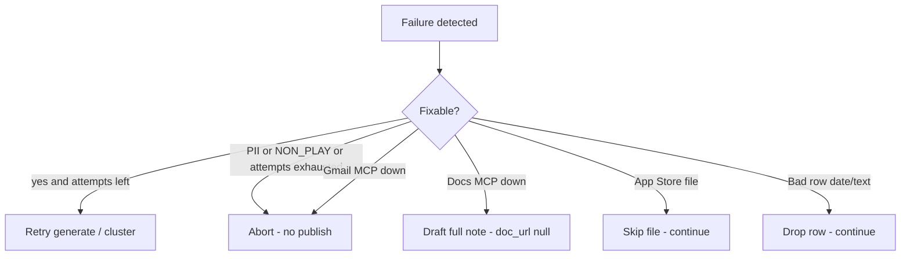

# Edge cases — Weekly Review Pulse

Corner scenarios the pipeline must handle without inventing reviews, leaking PII, calling Google REST, scraping the Groww Play Store listing, or publishing an invalid note. Sourced from [`architecture.md`](architecture.md) (§5, §10, §13–§15) and [`implementation-plan.md`](implementation-plan.md) (phases 1–6).

**Product under review:** Groww (`com.nextbillion.groww`) — https://play.google.com/store/apps/details?id=com.nextbillion.groww&hl=en_IN  
Reviews enter only as **local exports** under `data/exports/` (see that folder’s README).

**How to read each row**

| Column | Meaning |
| --- | --- |
| **ID** | Stable code for tests and logs |
| **Trigger** | What the operator or data does |
| **Expected behaviour** | Exact product rule — not “best effort” |
| **Severity** | `abort` = stop run; `skip` = continue with report; `retry` = regenerate; `degrade` = deliverable still met with a warning |
| **Phase** | Implementation phase that owns the fix |
| **Test** | Suggested test or manual check |

---

## 1. Ingest and exports (Phase 1)

| ID | Trigger | Expected behaviour | Severity | Phase | Test |
| --- | --- | --- | --- | --- | --- |
| `ING_NO_FILE` | `data/exports/` empty or path missing | Fail immediately with the expected path. Never fabricate reviews. | abort | 1 | missing-dir unit test |
| `ING_CORRUPT_FILE` | Truncated / unreadable CSV or JSON | Fail with a clear parse error; do not partially invent rows. | abort | 1 | corrupt fixture |
| `ING_APPSTORE_HEADERS` | File has App Store Connect shape (`Review ID` + `Reviewer Nickname`) | Skip file; record in ingest report; continue with any Play files. | skip | 1 | `test_ingest_rejects_appstore` |
| `ING_APPSTORE_FILENAME` | Filename contains `appstore` / `ios` | Same as above — skip and report. | skip | 1 | filename fixture |
| `ING_ONLY_APPSTORE` | Exports folder has only App Store files | After skips, corpus is empty → abort before cluster (`ING_EMPTY_CORPUS`). | abort | 1 | only-appstore fixture |
| `ING_MIXED_STORES` | One Play + one App Store file | Ingest Play only; App Store skipped and reported. | skip | 1 | mixed fixture |
| `ING_UNKNOWN_HEADERS` | No mappable `text` / `date` columns | Fail with detected headers + alias table so mapping can be extended. Do not guess. | abort | 1 | unknown-header fixture |
| `ING_PARTIAL_HEADERS` | Has text but no date (or vice versa) | Fail or drop unusable rows per mapping rules; never invent dates. Prefer fail if required fields cannot map. | abort | 1 | partial-header fixture |
| `ING_IDENTITY_COLUMNS` | Export includes reviewer name, email, device ID, profile URL | Drop those columns at mapping; they never appear in `reviews.normalized.json`. | skip (columns) | 1 | `test_ingest_drops_identity_columns` |
| `ING_EMPTY_TEXT` | Row with blank / whitespace-only body | Drop row; count in report. | skip | 1 | empty-text rows |
| `ING_BAD_DATE` | Unparseable date string | Drop row; count in report. | skip | 1 | bad-date rows |
| `ING_NULL_RATING` | Missing star rating | Keep row; `rating = null`. Ranking uses available ratings only. | continue | 1 | null-rating rows |
| `ING_OUTSIDE_12W` | Review older than corpus window | Drop from corpus. | skip | 1 | `test_ingest_window` |
| `ING_FUTURE_DATE` | Review date after `week_ending` / file max | Do not extend `week_ending` past the configured/max-in-file rule; drop or clamp per ingest policy (default: `week_ending` = max date in file, so future-dated relative to “today” is fine if present in export). | continue | 1 | future-date rows |
| `ING_EMPTY_CORPUS` | Zero reviews left after filters | Abort before clustering. No empty “fake” pulse. | abort | 1 | empty-corpus test |
| `ING_DUPES` | Same `date + rating + title + text` twice | Deduplicate on SHA-1 `id`; keep earliest. | skip (dup) | 1 | duplicate rows |
| `ING_ID_COLLISION` | Different rows hash to same 12-char id (extremely rare) | Keep earliest; log collision count in ingest report. | skip | 1 | forced-collision unit |
| `ING_JSON_ARRAY` | Export is JSON array instead of CSV | Accept if schema maps; same Play-only and window rules. | continue | 1 | json fixture |
| `ING_ENCODING` | UTF-8 BOM or non-UTF-8 bytes | Prefer UTF-8 with BOM strip; fail clearly if undecodable. | abort / continue | 1 | bom fixture |
| `ING_HUGE_FILE` | Tens of thousands of rows | Process in memory if feasible; still no scrape. Report counts. (Non-functional — may need streaming later, out of current scope.) | continue | 1 | optional soak |

---

## 2. Time windows and thin weeks (Phases 1, 3)

| ID | Trigger | Expected behaviour | Severity | Phase | Test |
| --- | --- | --- | --- | --- | --- |
| `WIN_THIN_WEEK` | Reporting week has &lt; `min_week_reviews` (15) | Widen reporting window to `fallback_days` (28); set `window_note = "4-week rollup (low weekly volume)"`. Never label it as a single week silently. | degrade (labelled) | 1 / 3 | `test_thin_week_fallback` |
| `WIN_THIN_AND_STILL_EMPTY` | Even 4-week rollup has 0 reviews | Abort — same as empty corpus for reporting. | abort | 1 | thin-empty fixture |
| `WIN_STALE_EXPORT` | Max date in file is weeks ago | `week_ending` = max date in file, not today. Note is honestly dated. | continue | 1 | stale export |
| `WIN_CORPUS_VS_REPORT` | Operator confuses 12-week corpus with weekly note | Cluster on full corpus; print counts/quotes/rank from reporting window only. | continue | 3 | window assertion |
| `WIN_TREND_ZERO_BASELINE` | Theme has 0 reviews in prior 11 weeks, &gt;0 this week | Treat baseline carefully: avoid divide-by-zero; if `b = 0` and `w > 0`, trend = `rising`. | continue | 3 | `test_trend_calculation` edge |
| `WIN_TREND_BOUNDARY_HI` | `w == 1.25 × b` | `rising` (≥). | continue | 3 | boundary test |
| `WIN_TREND_BOUNDARY_LO` | `w == 0.75 × b` | `falling` (≤). | continue | 3 | boundary test |
| `WIN_SINGLE_DAY_SPIKE` | All reporting-week reviews on one day | Still valid week; counts and quotes use that window. | continue | 3 | spike fixture |

---

## 3. Redaction and privacy (Phases 2, 5)

| ID | Trigger | Expected behaviour | Severity | Phase | Test |
| --- | --- | --- | --- | --- | --- |
| `PII_EMAIL_IN_BODY` | `user@example.com` in review text | Replace with `[email]` before any model call. | continue | 2 | `test_redact_patterns` |
| `PII_PHONE` | `+91 98xxx` / dashed numbers | → `[phone]`. | continue | 2 | same |
| `PII_HANDLE` | `@someone` in text | → `[handle]`. | continue | 2 | same |
| `PII_URL` | `https://…` or `www.…` | → `[link]`. | continue | 2 | same |
| `PII_LONG_ID` | 8+ digit account-like token | → `[id]`. | continue | 2 | same |
| `PII_SIGNED_NAME` | Trailing `- Firstname L.` | → `[name]`. | continue | 2 | same |
| `PII_PRESERVE_AMOUNT` | `₹500`, `5 stars`, `4.2` | Must **not** be redacted. | continue | 2 | `test_redact_preserves_amounts` |
| `PII_PRESERVE_VERSION` | `v3.4.1` | Must survive. | continue | 2 | same |
| `PII_TITLE_ONLY` | PII only in title, not body | Redact title too. | continue | 2 | title PII fixture |
| `PII_MODEL_REINTRODUCES` | Theme summary or action invents an email/name | Final scan on `pulse.md` → `PII_DETECTED`; **hard abort**, no retry, no publish. Log category only, never matched value. | abort | 5 | `test_pii_gate_aborts` |
| `PII_IN_QUOTE_PLACEHOLDER` | Quote candidate still contains `[email]` / similar | Exclude from quote pool (residual placeholder rule). | skip | 3 | pool filter test |
| `PII_LOG_LEAK` | Validator logs the matched email string | Forbidden — log category only. | abort (policy) | 5 | assert log content |
| `PII_MCP_PAYLOAD` | Publish sends full corpus to Docs/Gmail | Forbidden — MCP payload is finished note (+ Doc URL) only. | abort (policy) | 6 | fake-tool arg assert |
| `PII_LANGSMITH_ON` | `LANGSMITH_TRACING=true` | Allowed only if operator accepts review text in traces; default off. | warn | 7 | config check |

---

## 4. Clustering and themes (Phases 3–4)

| ID | Trigger | Expected behaviour | Severity | Phase | Test |
| --- | --- | --- | --- | --- | --- |
| `CLU_OVER_FIVE` | Model returns &gt;5 themes | Reject structured output; retry once (`cluster_max_attempts`); then merge smallest into `other`. Never publish &gt;5. | retry → merge | 4 | stub &gt;5 themes |
| `CLU_THEME_CAP_VALIDATE` | `themes.json` still has &gt;5 after cluster | `THEME_CAP` — fixable if generate path can recover; prefer fail closed before generate if cluster already violated. | retry / abort | 5 | validate test |
| `CLU_OMITTED_IDS` | Batch response misses some `review_id`s | Unassigned → `other`. No retry required. | continue | 4 | partial-batch stub |
| `CLU_UNKNOWN_LABEL` | Model invents a theme_id not in seeds ∪ `{other}` | Treat as `other` (or reject batch and retry once). | continue / retry | 4 | unknown-label stub |
| `CLU_OTHER_DOMINATES` | `other` &gt; 20% of corpus and theme count &lt; 5 | One split pass for a new theme; never exceed 5. | continue | 4 | other-heavy fixture |
| `CLU_OTHER_DOMINATES_AT_CAP` | `other` &gt; 20% but already 5 themes | Leave `other`; do not add a sixth. | continue | 4 | five-seed config |
| `CLU_ALL_OTHER` | Every review lands in `other` | Still ≤5 themes; top-3 highlight may include `other` only if fewer than 3 real themes exist. | continue | 4 | all-other stub |
| `CLU_FEWER_THAN_THREE` | Only 1–2 themes have any reviews | Highlight what exists; validate `THEME_COUNT` may fail if schema requires exactly 3 — prefer padding policy: allow fewer than 3 in pulse **or** fail generate with clear error. **Architecture requires exactly 3 top themes** → if impossible, abort with explanation (not invent themes). | abort | 4 / 5 | sparse-themes fixture |
| `CLU_TIE_VOLUME` | Two themes same `count_week` | Rank by lower `avg_rating_week`, then `id` alpha. Deterministic. | continue | 3 | `test_ranking_is_deterministic` |
| `CLU_NULL_AVG_RATING` | Theme has no ratings in week | Tie-break: treat missing avg as worse or last; document choice (recommend: sort missing avg after rated themes when ascending pain, or use a sentinel). Must remain deterministic. | continue | 3 | null-avg ranking |
| `CLU_BATCH_API_FAIL` | One cluster batch call fails | Retry that batch; if exhausted, abort cluster (do not publish partial themes as final). | retry → abort | 4 | mocked API error |
| `CLU_SEES_RAW` | Cluster prompt accidentally gets normalized (unredacted) file | Forbidden. Only `reviews.redacted.json`. | abort (policy) | 4 | input-path assert |

---

## 5. Quotes, actions, and generate (Phases 3–5)

| ID | Trigger | Expected behaviour | Severity | Phase | Test |
| --- | --- | --- | --- | --- | --- |
| `GEN_MODEL_TYPES_QUOTE` | Model returns free-text quote instead of `review_id` | Reject; use `review_id` only. Render looks up text. | retry | 4 | schema enforcement |
| `GEN_BAD_REVIEW_ID` | `review_id` not in pool / not in redacted set | Exclude; regenerate (`QUOTE_NOT_VERBATIM` / invalid id). | retry | 5 | bad-id stub |
| `GEN_TAMPERED_QUOTE` | `pulse.json` text ≠ source substring | `QUOTE_NOT_VERBATIM` → regenerate with that id excluded (max 3 attempts). | retry | 5 | `test_quote_provenance` |
| `GEN_QUOTE_OUT_OF_WINDOW` | Quote’s review outside reporting window | `QUOTE_OUT_OF_WINDOW` → fixable retry. | retry | 5 | out-of-window id |
| `GEN_EMPTY_QUOTE_POOL` | Theme has no candidates in length/PII/similarity rules | Fall back: relax length slightly within config, or pick best available corpus week candidate **only if still in reporting window**; if still empty, fail that theme’s quote and retry/abort. Never invent text. | retry / abort | 3 / 4 | empty-pool fixture |
| `GEN_SHORT_REVIEWS_ONLY` | All texts &lt; `quote_min_chars` | Cannot meet verbatim long quotes — abort or lower min in config with explicit note; do not pad with invented words. | abort / config | 3 | short-text fixture |
| `GEN_NEAR_DUPLICATE_QUOTES` | Two candidates almost identical | Similarity ≥ 0.8 → exclude second from pool. | skip | 3 | near-dup fixture |
| `GEN_TOO_MANY_WORDS` | Body &gt; 250 words | `WORD_LIMIT` → regenerate with measured overage in prompt. | retry | 5 | long stub |
| `GEN_WORD_COUNT_AT_250` | Body exactly 250 | Pass (≤ 250). | continue | 5 | boundary |
| `GEN_HEADINGS_INFLATE_COUNT` | Naive counter counts `#` headings | Must use §10.5 rule (exclude headings + metadata). | continue | 3 | `test_word_count_rule` |
| `GEN_WRONG_ACTION_COUNT` | 2 or 4 actions | `ACTION_COUNT` → retry. | retry | 5 | schema / validate |
| `GEN_ACTION_BAD_THEME` | Action `theme_id` not in top 3 | `ACTION_COUNT` / invalid theme → retry. | retry | 5 | bad theme_id |
| `GEN_ACTION_RESTATES_SUMMARY` | Action copies theme summary | Prompt forbids; soft quality issue — validate cannot always catch; manual close-out spot-check. | warn | 7 | manual |
| `GEN_RETRIES_EXHAUSTED` | Still failing after `generate_max_attempts` (3) | Abort. Keep artifacts. Publish nothing. | abort | 5 | retry-cap test |
| `GEN_NON_PLAY_IN_STATE` | Any review with `store != play_store` | `NON_PLAY_DATA` — **not** fixable; hard abort. | abort | 5 | inject app_store row |

---

## 6. Validate and graph routing (Phase 5)

| ID | Trigger | Expected behaviour | Severity | Phase | Test |
| --- | --- | --- | --- | --- | --- |
| `VAL_MULTI_FAILURE` | Word limit + bad quote in one pass | Collect **all** failure codes; one retry prompt lists all of them. | retry | 5 | multi-fail stub |
| `VAL_FIXABLE_THEN_PASS` | First generate fails, second passes | Edge to publish only after pass. | continue | 5 | graph integration |
| `VAL_PII_NO_RETRY` | `PII_DETECTED` | Abort immediately — no loop back to generate. | abort | 5 | `test_pii_gate_aborts` |
| `VAL_ATTEMPTS_STUCK` | `attempts` not incremented | Must increment or retry is infinite — treat as bug. | abort (bug) | 5 | counter assert |
| `VAL_PUBLISH_SKIPPED_ON_FAIL` | Validate fails | `publish_doc` / `draft_email` never called. | abort | 5 | mock publish not called |

---

## 7. Docs and Gmail MCP (Phase 6)

| ID | Trigger | Expected behaviour | Severity | Phase | Test |
| --- | --- | --- | --- | --- | --- |
| `MCP_NO_ADAPTER` | `langchain-mcp-adapters` unavailable but course tools exist | Bind environment MCP tools; **never** add Google REST client. | continue | 6 | startup bind |
| `MCP_TOOL_UNRESOLVED` | No tool matches create-doc / draft | Fail at startup listing exposed tools. | abort | 6 | empty tool list |
| `MCP_DOCS_DOWN` | Docs MCP error / timeout | Continue to Gmail; draft **full note inline**; `doc_url: null`; warning. Deliverable still met. | degrade | 6 | fake Docs fail |
| `MCP_GMAIL_DOWN` | Gmail MCP error | Hard fail. Keep Doc + local `pulse.md` if Doc succeeded. | abort | 6 | fake Gmail fail |
| `MCP_BOTH_DOWN` | Docs and Gmail fail | Hard fail (draft required). Local artifacts remain. | abort | 6 | both-fail |
| `MCP_DOCS_OK_GMAIL_OK` | Happy path | Doc URL + draft id in `pulse.json`; draft **not** sent. | continue | 6 | manual / fake success |
| `MCP_RERUN_SAME_WEEK` | Second run same `week_ending` | Update existing Doc via `doc_registry.json`; create a **new** draft (do not auto-send). No duplicate Doc titles littering Drive. | continue | 6 | registry update test |
| `MCP_REGISTRY_STALE` | Registry points to deleted Doc | Create fails on update → create new Doc, overwrite registry entry. | degrade | 6 | stale id mock |
| `MCP_MARKDOWN_UNSUPPORTED` | Docs tool accepts plain text only | Render plain-text variant of **same** `Pulse` — never a separately written note. | continue | 6 | plain-text render |
| `MCP_LINK_ONLY_MODE` | `email_body_mode: link_only` and Docs failed | Must not send empty pointer — fall back to full note inline when `doc_url` is null. | degrade | 6 | mode + null url |
| `MCP_WRONG_RECIPIENT` | Misconfigured alias | Uses `config.delivery.recipient` as-is; fail if missing. | abort | 0 / 6 | config fail-fast |
| `MCP_ACCIDENTAL_SEND` | Tool named `send` instead of `draft` | Capability match must require **draft**; never call send. | abort (policy) | 6 | tool-name filter |
| `MCP_REST_FALLBACK_TEMPTATION` | Engineer adds `google-api-python-client` | Forbidden by architecture and implementation plan. | abort (policy) | 0 / 6 | requirements audit |

---

## 8. Config and scaffold (Phase 0)

| ID | Trigger | Expected behaviour | Severity | Phase | Test |
| --- | --- | --- | --- | --- | --- |
| `CFG_MISSING_KEY` | Required YAML/env key absent | Fail fast at startup. | abort | 0 | config test |
| `CFG_FIVE_SEEDS_NO_OTHER` | 5 seeds and `max_total: 5` | `other` can only appear by displacing a seed — document in config comments; split may be impossible. | continue | 0 | config note |
| `CFG_BAD_RECIPIENT` | Empty `delivery.recipient` | Fail before publish. | abort | 0 / 6 | config |
| `CFG_MODEL_MISSING` | No API key when reaching cluster | Fail at Phase 4 with clear message (scaffold may run without key). | abort | 4 | env check |

---

## 9. Observability and artifacts

| ID | Trigger | Expected behaviour | Severity | Phase | Test |
| --- | --- | --- | --- | --- | --- |
| `OBS_PARTIAL_ARTIFACTS` | Abort mid-pipeline | Leave last good artifacts on disk; do not delete evidence. | continue | 5 | abort leaves files |
| `OBS_STATUS_BLOCK` | Successful or warned run | Print window, counts, themes, `body_word_count`, `doc_url`, `draft_id`, warnings. | continue | 5 / 6 | golden log |
| `OBS_QUOTE_AUDIT` | Reviewer challenges a quote | `pulse.json` + `themes.json` + redacted review by `review_id` must reconstruct it. | continue | 7 | close-out spot-check |

---

## 10. Severity quick reference

| Severity | Publish Doc? | Create Gmail draft? |
| --- | --- | --- |
| continue / skip (row/file) | if rest of run passes | if rest of run passes |
| retry (then pass) | yes | yes |
| degrade (Docs down) | no | **yes** (full note) |
| abort | no | no (unless Docs already wrote and only Gmail fails — Doc remains, draft missing) |

---

## 11. Must-test matrix (minimum)

These edge cases are required by architecture §15 and the implementation plan; treat them as a gate before Phase 7:

| Test | Edge IDs covered |
| --- | --- |
| `test_ingest_window` | `ING_OUTSIDE_12W`, `WIN_STALE_EXPORT` |
| `test_ingest_rejects_appstore` | `ING_APPSTORE_*`, `ING_MIXED_STORES` |
| `test_ingest_drops_identity_columns` | `ING_IDENTITY_COLUMNS` |
| `test_redact_patterns` | `PII_EMAIL_*` … `PII_SIGNED_NAME` |
| `test_redact_preserves_amounts` | `PII_PRESERVE_*` |
| `test_ranking_is_deterministic` | `CLU_TIE_VOLUME` |
| `test_trend_calculation` | `WIN_TREND_*` |
| `test_word_count_rule` | `GEN_HEADINGS_INFLATE_COUNT`, `GEN_WORD_COUNT_AT_250` |
| `test_quote_provenance` | `GEN_TAMPERED_QUOTE` |
| `test_pii_gate_aborts` | `PII_MODEL_REINTRODUCES`, `VAL_PII_NO_RETRY` |
| `test_thin_week_fallback` | `WIN_THIN_WEEK` |
| Fake MCP tools | `MCP_DOCS_DOWN`, `MCP_GMAIL_DOWN`, `MCP_RERUN_SAME_WEEK`, `MCP_ACCIDENTAL_SEND` |

---

## 12. Explicit non-scenarios (do not “handle” by implementing)

These look like edge cases but are **out of scope** — the correct behaviour is to refuse:

| Temptation | Correct response |
| --- | --- |
| Scrape Groww listing when CSV is missing | Abort (`ING_NO_FILE`); do not scrape https://play.google.com/store/apps/details?id=com.nextbillion.groww |
| Pull App Store to “fill” a thin week | Skip / abort; never ingest |
| Call Google REST when MCP is down | Fail / degrade per §7; no REST client |
| Auto-send the Gmail draft | Draft only |
| Invent a fourth quote to pad | Abort or retry; never invent |
| Invent themes when only two exist | Abort with explanation (`CLU_FEWER_THAN_THREE`) |

---

## 13. Mapping to definition of done

| Done criterion | Edge cases that most often break it |
| --- | --- |
| Play only, 8–12 weeks | `ING_APPSTORE_*`, `ING_OUTSIDE_12W`, `ING_EMPTY_CORPUS` |
| Redacted before LLM | `PII_*`, `CLU_SEES_RAW` |
| ≤5 themes, top 3 | `CLU_OVER_FIVE`, `CLU_FEWER_THAN_THREE`, `CLU_OTHER_*` |
| 3 verbatim quotes, 3 actions, ≤250 words | `GEN_*`, `VAL_MULTI_FAILURE` |
| Docs via MCP | `MCP_DOCS_*`, `MCP_RERUN_SAME_WEEK` |
| Gmail draft via MCP | `MCP_GMAIL_DOWN`, `MCP_ACCIDENTAL_SEND`, `MCP_LINK_ONLY_MODE` |
| No PII in artifacts | `PII_MODEL_REINTRODUCES`, `PII_MCP_PAYLOAD`, `PII_LOG_LEAK` |
