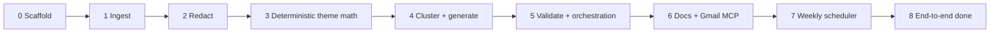
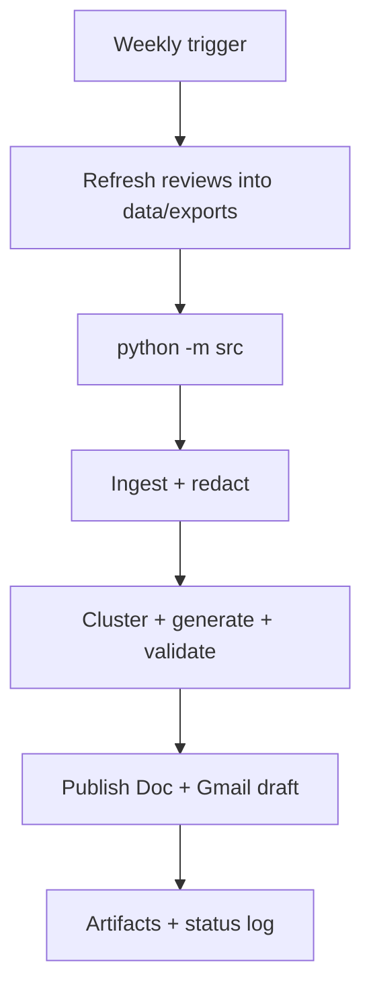

# Implementation plan — Weekly Review Pulse

Phase-wise build plan for the **LangChain AI agent** defined in [`architecture.md`](architecture.md), against the deliverable in [`problemStatement.md`](problemStatement.md).

**Agent stack**

| Layer | Role | Required? |
| --- | --- | --- |
| **LangChain** | AI agent: cluster + generate (structured output), MCP tool binding for Docs/Gmail | **Yes** |
| **Orchestration** | After generate: validate → retry / abort / publish | **Yes** (the *behaviour*) |
| **LangGraph** | One way to implement that orchestration (state machine + edges) | **No** — recommended |
| **Python runner** | Alternative: `while` / `if` around the same LangChain chains | **Yes** as LangGraph alternative |

**Scope (do not reopen):** Groww Play Store exports only (`com.nextbillion.groww`). App Store is out of scope. Do **not** scrape https://play.google.com/store/apps/details?id=com.nextbillion.groww&hl=en_IN. Google Docs and Gmail go through MCP only — no Google REST or OAuth client in this repo.

**How to use this plan.** Complete phases in order. A phase is done when every acceptance check is true. Do not start MCP publish (Phase 6) until the local pulse validates. Do not start the weekly scheduler (Phase 7) until publish works once by hand. Do not start LLM stages (Phase 4) until ingest, redact, and the fixture exist.

---

## Outcome this plan produces

A local command (`python -m src`) that:

1. Reads a public **Groww** Play Store export (8–12 week corpus) for `com.nextbillion.groww`.
2. Redacts PII, clusters into ≤5 themes, writes a weekly note (top 3 themes, 3 verbatim quotes, 3 actions, ≤250 words).
3. Appends the pulse to an existing Google Doc via Docs MCP (`append_to_google_doc`).
4. Creates a Gmail **draft** (never sent) with the note or a clear link to the Doc.
5. Optionally runs on a **weekly schedule**: refresh reviews → classify → validate → publish report.

That is the problem-statement “done” list, plus an ops loop so the pulse stays current.

---

## Phase map



| Phase | Name | Kind | Unlocks |
| --- | --- | --- | --- |
| 0 | Scaffold | Repo / config / schemas | Everything else |
| 1 | Ingest | Deterministic | Date window, Play-only gate |
| 2 | Redact | Deterministic | Safe inputs for the LLM |
| 3 | Theme math + render | Deterministic | Ranking, trends, `pulse.md` shape |
| 4 | Cluster + generate | **LangChain** LLM agent | Themes and note content |
| 5 | Validate + orchestration | Deterministic gates + retry/abort | Retry, PII abort, no publish of junk |
| 6 | Publish | MCP tools | Doc + Gmail draft |
| 7 | Weekly scheduler | Ops / automation | Fresh reviews → classify → report each week |
| 8 | Close-out | Manual + tests | Definition of done |

---

## Phase 0 — Scaffold

**Goal.** Empty-but-runnable project that matches architecture §7–§8. No pipeline logic yet.

### Build

- [ ] Create the directory tree: `src/agent/`, `prompts/`, `data/exports/`, `data/artifacts/`, `data/state/`, `tests/fixtures/`.
- [ ] Add `.gitignore`: `data/exports/`, `data/artifacts/`, `.env`, `__pycache__/`, `.venv/`. Track `data/state/doc_registry.json` as `{}`.
- [ ] Write `requirements.txt`: `langchain-core`, `langgraph`, a chat-provider package (e.g. `langchain-openai`), `langchain-mcp-adapters`, `pydantic`, `pyyaml`, `pytest`. **Do not** add `google-api-python-client`, `google-auth`, or similar.
- [ ] Write `config.yaml` with the keys in architecture §8 (`product_name`, windows, theme seeds, note limits, delivery, `limits`).
- [ ] Write `.env.example` (`OPENAI_API_KEY` or equivalent, `PULSE_MODEL`, MCP server names, LangSmith off).
- [ ] Implement `src/config.py` — load YAML + env; fail fast on missing required keys.
- [ ] Implement `src/schemas.py` — Pydantic: `Review`, `Theme`, `Pulse`, `ValidationResult` exactly as §9.
- [ ] Stub `src/__main__.py` so `python -m src` prints config and exits 0.
- [ ] Write `tests/fixtures/play_reviews_sample.csv` (~40 synthetic Play rows spanning 12 weeks, planted emails/phones/handles, plus a second App Store–shaped fixture file).

### Acceptance

- `python -m src` runs without a model key (scaffold only).
- `pytest` collects (even if no tests yet).
- `requirements.txt` has no Google client libraries.
- Fixture includes PII and an App Store file so later phases have something to reject.

**Do not.** Call any LLM or MCP. Do not scrape the Groww Play Store listing.

---

## Phase 1 — Ingest

**Goal.** Turn a local Groww Play Store CSV/JSON into `reviews.normalized.json` + an ingest report (architecture §10.1, §5).

### Build

- [ ] `src/ingest.py`
  - Map columns via the alias table (case-insensitive).
  - Drop unmapped / identity columns (name, profile URL, user id, device id).
  - Reject App Store Connect shape (`Review ID` + `Reviewer Nickname`, or `appstore`/`ios` in the filename); record the skip.
  - Parse dates; drop empty text and unparseable dates.
  - Drop reviews with **fewer than 8 words** in `Review Text`.
  - Drop reviews whose body is **not English** (script check + `langdetect` on the text; keep `en` only).
  - Set `week_ending` = max date in file (or config override).
  - Keep the 12-week **corpus** window.
  - Compute reporting window (`reporting_days`); if week count &lt; `min_week_reviews`, widen to `fallback_days` and set a `window_note` later used by generate.
  - Deduplicate on SHA-1 `id` (`date + rating + title + text`, 12 chars).
  - Set `store` = `"play_store"` only.
- [ ] Write artifacts: `data/artifacts/reviews.normalized.json`, ingest report (rows in/kept/dropped including `short_text` / `non_english`, App Store skips, min/max date).
- [ ] Tests: `test_ingest_window`, `test_ingest_rejects_appstore`, `test_ingest_drops_identity_columns`, empty-corpus abort, short/non-English drops.

### Acceptance

- Sample Play fixture produces normalized reviews with no identity fields.
- App Store fixture is skipped and reported, never mixed in.
- Reviews older than 12 weeks are dropped; `week_ending` is the max date in the file.
- Reviews with &lt; 8 words or non-English body are dropped and counted in the ingest report.
- No HTTP calls anywhere in `ingest.py`.

**Depends on.** Phase 0. **Blocks.** Phase 2.

---

## Phase 2 — Redact

**Goal.** PII-safe `reviews.redacted.json` is the only text any later stage (including the LLM) may see (architecture §10.2, §14).

### Build

- [ ] `src/redact.py` — apply replacements on `title` and `text` only:
  - email → `[email]`
  - phone → `[phone]`
  - long IDs (8+ digits / alphanumeric ≥12 with digits) → `[id]`
  - URLs → `[link]`
  - `@handle` → `[handle]`
  - trailing signed name → `[name]`
- [ ] Preserve `₹500`, `5 stars`, `4.2`, `v3.4.1`.
- [ ] Discard raw title/text; never write them to an artifact.
- [ ] Tests: `test_redact_patterns`, `test_redact_preserves_amounts`.

### Acceptance

- Planted PII in the fixture is gone from `reviews.redacted.json`.
- Amounts, star ratings, and version strings survive.
- Cluster/generate modules (when added) import only the redacted file.

**Depends on.** Phase 1. **Blocks.** Phase 4 (LLM must not start before this).

---

## Phase 3 — Theme math, quote pool, and render

**Goal.** All deterministic pieces that sit around the LLM: ranking, trends, quote-candidate selection, markdown rendering (architecture §5, §9.2, §10.4–§10.5, §11).

No model calls in this phase. Use hand-built `themes` / `Pulse` objects in tests.

### Build

- [ ] Theme ranking: `count_week` desc, then `avg_rating_week` asc, then `id` alpha. Exclude `other` from top 3 unless fewer than 3 real themes.
- [ ] Trend: `w ≥ 1.25×b` rising, `w ≤ 0.75×b` falling, else steady. Compute `count_corpus`, `count_week`, `avg_rating_week`, `baseline_weekly` in Python.
- [ ] Quote pool builder:
  - Reporting-window reviews only.
  - Length `quote_min_chars`–`quote_max_chars`.
  - No residual redaction placeholders.
  - Near-duplicate similarity &lt; 0.8.
  - Rank by `abs(rating − theme_avg)` so quotes are representative.
  - Return `review_id`s, **never** invented strings.
- [ ] `src/render.py` — `Pulse` → `pulse.md` matching the worked example in §11. Same function later feeds Docs and Gmail.
- [ ] Word-count helper (architecture §10.5): count theme summaries, quote text, action titles/details; exclude headings, metadata line, numeric labels, markdown punctuation.
- [ ] Tests: `test_ranking_is_deterministic`, `test_trend_calculation`, `test_word_count_rule`, `test_thin_week_fallback`, `test_render.py` vs. the worked example shape.

### Acceptance

- Identical inputs produce identical theme order.
- Thin week (&lt; 15 reviews) sets `window_note` and uses 4 weeks.
- Rendered markdown has the three required sections: Top themes, What users said, Action ideas.

**Depends on.** Phases 0–2. **Blocks.** Phase 4 (generate looks up quotes via this pool + render).

---

## Phase 4 — LangChain AI agent (cluster + generate)

**Goal.** Build the AI agent pieces with **LangChain**: LLM stages that only emit structured JSON (architecture §6, §10.3, §10.4). Prompts live in `prompts/`. This phase is where LangChain is required and sufficient for clustering and pulse writing.

### Build — cluster

- [ ] `prompts/cluster.md` — assign each review to `theme_id` ∈ seeds ∪ `{other}`; no quotes, no prose summaries.
- [ ] `src/cluster.py`
  - Batch size `cluster_batch_size` (25).
  - `with_structured_output` for `[{review_id, theme_id, confidence}]`.
  - Unassigned / unknown → `other`.
  - If `other` &gt; 20% of corpus **and** theme count &lt; 5, one split pass; never exceed 5 themes.
  - If model returns &gt;5 themes: reject, retry once (`cluster_max_attempts`), then merge smallest into `other`.
  - Attach stats + ranking from Phase 3.
  - Write `data/artifacts/themes.json`.
- [ ] Stubbed-model unit test: canned assignments → correct `themes.json` shape and cap of 5.

### Build — generate

- [ ] `prompts/pulse.md` — write **only** three theme summaries and three actions; select quote by `review_id` from the pool; ≤250 words; one action per highlighted theme.
- [ ] `src/generate.py`
  - Input: top 3 themes + ~8 quote candidates per theme (Phase 3 pool), reporting-window reviews only.
  - Model returns summaries, actions, and three `review_id`s — **not** quote text.
  - `render.py` fills quote `text` from the redacted review.
  - Write `pulse.json` and `pulse.md`.
- [ ] Stubbed-model test: given known `review_id`s, rendered quotes match source text.

### Acceptance

- Cluster output has ≤5 themes; pulse has exactly 3 top themes, 3 quotes, 3 actions.
- Quotes in `pulse.md` are exact substrings of redacted reviews (spot-check).
- Prompts and chains never receive `reviews.normalized.json`.

**Depends on.** Phases 2–3 and a working API key for a **manual** smoke run (tests stay stubbed). **Blocks.** Phase 5.

---

## Phase 5 — Validate and orchestration (LangGraph optional)

**Goal.** Enforce gates after the LangChain agent produces a pulse. Phase 5 needs **orchestration behaviour**, not LangGraph as a library:

1. Run **validate** (word limit, counts, verbatim quotes, PII, etc.).
2. **Retry** `generate` only when the failure is fixable and attempts remain (default max 3).
3. **Abort** on PII / non-fixable errors — keep artifacts; do **not** publish.
4. **Publish only on pass** (Phase 6).

**LangGraph** is a recommended way to encode that as a state machine (architecture §6.0, §6.3–§6.5). **LangChain + a Python runner** is equally valid. Still no Google in this phase.

### Build — validate

- [ ] `src/validate.py` — run **all** checks, collect codes:
  - Fixable: `WORD_LIMIT`, `THEME_COUNT`, `THEME_CAP`, `QUOTE_COUNT`, `QUOTE_NOT_VERBATIM`, `QUOTE_OUT_OF_WINDOW`, `ACTION_COUNT`.
  - Not fixable: `NON_PLAY_DATA`, `PII_DETECTED` (re-run redact patterns on `pulse.md`).
- [ ] `ValidationResult.fixable` drives routing.
- [ ] Tests: `test_quote_provenance`, `test_pii_gate_aborts` (email in the note never “publishes”).

### Build — orchestrator (pick one)

- [ ] **Option A — LangGraph (recommended):** `src/agent/state.py`, `nodes.py`, `graph.py`
  - Edges: ingest → redact → cluster → generate → validate.
  - validate → generate if fixable and `attempts < generate_max_attempts`.
  - validate → end if PII or attempts exhausted (leave artifacts; do not call publish).
  - validate → publish_doc (Phase 6) on pass.
- [ ] **Option B — Python runner (LangChain only for LLM):** in `src/__main__.py` or `src/agent/runner.py`, loop:

```text
pulse = generate(...)
while not validate(pulse).passed:
    if not fixable or attempts >= 3: abort
    pulse = generate(... retry with failure codes ...)
# only then: publish_doc / draft_email (Phase 6)
```

- [ ] Retry prompt includes failure codes only; same redacted artifacts — never raw export.
- [ ] `python -m src` runs through validate and prints a status block (window, counts, themes, `body_word_count`).
- [ ] Each stage logs one summary line (§16).

### Acceptance

- `pytest` covers architecture §15 rows that do not need MCP.
- A tampered quote fails `QUOTE_NOT_VERBATIM` and retries (or aborts after 3).
- A note containing an email aborts with no publish hook invoked.
- Over-250-word stub output retries and/or fails closed.
- Orchestration works whether implemented with LangGraph **or** the Python runner.

**Depends on.** Phase 4. **Blocks.** Phase 6.

---

## Phase 6 — Google Docs and Gmail via MCP

**Goal.** Problem-statement integrations: pulse in Docs, draft in Gmail, MCP-first (architecture §6.6, §10.6–§10.7, §13).

**MCP server (this project).** Deployed Google Workspace MCP — not separate Cursor course Docs/Gmail servers:

| Item | Value |
| --- | --- |
| Repo | https://github.com/himabindu-ai205/MCP-Server |
| Railway URL | `https://mcp-server-production-f0ca.up.railway.app` |
| Health | `GET /health` → `{"status":"ok","server":"google-workspace","transport":"http"}` |
| MCP endpoint | `{MCP_SERVER_URL}/mcp` (Streamable HTTP) |
| Auth | `Authorization: Bearer {MCP_HTTP_TOKEN}` (or `X-MCP-Token`) |
| Tools used | `append_to_google_doc`, `create_email_draft` |
| Tools never used | `send_email` (agent must never call it) |

**Constraint vs original “create Doc” plan.** This MCP server **cannot create** Google Docs — only `append_to_google_doc` with an existing `documentId`. Create one Doc manually in Drive, then set `GOOGLE_DOC_ID` in `.env`. Idempotency still uses `data/state/doc_registry.json` (`week_ending` → doc id); re-runs for the same week **append** to the same Doc (week banner + pulse markdown), not a new Drive file.

### Build

- [x] Confirm Railway MCP is up (`/health`) and auth is required on `/mcp`.
- [x] Env: `MCP_SERVER_URL`, `MCP_HTTP_TOKEN`, `GOOGLE_DOC_ID` (see `.env.example`). `DOCS_MCP_SERVER` / `GMAIL_MCP_SERVER` = `google-workspace`.
- [x] `src/publish.py`
  - Load tools with `langchain-mcp-adapters` `MultiServerMCPClient` (`transport: streamable_http`, Bearer header).
  - Resolve by capability: prefer `append_to_google_doc` / `create_email_draft`; never bind `send_email`.
  - Fail fast with the exposed tool list if the draft tool is missing.
- [x] Docs path (`publish_doc`)
  - Body = rendered `pulse.md` (markdown) prefixed with `config.delivery.doc_title` week banner.
  - Target id = registry[`week_ending`] → else `GOOGLE_DOC_ID` → else registry[`_default`].
  - Soft-fail: on append error, warn, continue with `doc_url: null`.
  - Write `doc_url` / `draft_id` into `pulse.json` + `publish_report.json`.
- [x] Gmail path (`draft_email`)
  - To = `config.delivery.recipient`; subject from `config.delivery.email_subject`.
  - Default body mode `full_note_plus_link`; if `link_only` and Docs failed, fall back to full note inline.
  - **Create draft only — never `send_email`.**
- [x] Pipeline: after Phase 5 validate passes, `__main__` calls `publish_pulse` (LangGraph `publish` node still accepts a `publish_fn` hook). Use `--skip-publish` for local LLM-only runs.
- [x] Error policy:
  - Docs down / missing `GOOGLE_DOC_ID` → still draft full note inline, `doc_url: null`, warn.
  - Gmail down → hard fail (`PublishError`); keep local `pulse.md` (+ Doc append if it succeeded).
- [x] Fake-tool tests in `tests/test_phase6.py`: append args, registry reuse, Docs soft-fail, Gmail hard-fail, never `send_email`. No live Google in CI.

### Acceptance

- One successful manual run with `MCP_HTTP_TOKEN` + `GOOGLE_DOC_ID`: Doc receives an appended weekly section; Gmail shows a **draft** to the alias with the note or Doc link.
- Second run for the same `week_ending` appends to the **same** Doc id (registry), does not invent a second Drive file.
- `requirements.txt` has `langchain-mcp-adapters` and **no** Google REST/OAuth client libraries.
- Draft was not auto-sent (`send_email` never invoked).

**Depends on.** Phase 5 + Railway MCP secrets (`MCP_HTTP_TOKEN`, Google OAuth on the server) + a pre-created Doc id. **Blocks.** Phase 7.

---

## Phase 7 — Weekly scheduler (refresh → classify → report)

**Goal.** Run the full pulse **every week** without a manual click: download / refresh new Groww Play reviews, classify (cluster + generate + validate), then publish the report (Docs append + Gmail draft).

This phase is **ops automation** on top of Phases 1–6. It does not change theme math, prompts, or MCP tool contracts.

### Weekly job flow



| Step | What happens | Owner |
| --- | --- | --- |
| 1. Trigger | Fire once per week (e.g. Monday 09:00 local) | OS scheduler or in-process schedule |
| 2. Refresh reviews | Write / update `data/exports/groww_play_reviews.csv` with newest public Groww reviews (enough for the 8–12 week corpus window) | `scripts/scrape_groww_play_reviews.py` **or** drop a Play Console CSV |
| 3. Classify | Existing pipeline: ingest → redact → cluster → generate → validate | `python -m src` |
| 4. Report | On validate pass: append Doc + create Gmail draft | Phase 6 `publish.py` |
| 5. Record | Append a line to a weekly run log; keep `data/artifacts/` for that run | Scheduler wrapper |

### Build

- [ ] Add `scripts/run_weekly_pulse.py` (or `src/schedule.py`) that:
  1. Acquires a simple lock file (`data/state/weekly.lock`) so overlapping runs abort.
  2. Refreshes reviews (calls the scrape script, or skips refresh if `--skip-fetch` / a fresh Console CSV is already present).
  3. Invokes the same path as `python -m src` (subprocess or in-process `main()`).
  4. Writes `data/artifacts/weekly_run.jsonl` with `{started_at, finished_at, week_ending, status, draft_id, doc_url, error}`.
  5. Exits non-zero on ingest empty / validate abort / publish hard-fail so the OS scheduler can alert.
- [ ] Config (optional keys in `config.yaml` under `schedule:`):
  - `enabled: false` by default
  - `day_of_week` / `hour_local` (documentation for Task Scheduler / cron)
  - `fetch_before_run: true`
  - `export_path: data/exports/groww_play_reviews.csv`
- [ ] Document how to install the trigger on the builder’s machine:
  - **Windows:** Task Scheduler → weekly → `py -3 scripts\run_weekly_pulse.py`
  - **macOS/Linux:** cron / `launchd` → same command
  - **Optional in-process:** `APScheduler` / `schedule` only if you want a long-running `python -m src --daemon`; prefer OS cron for simplicity
- [ ] Idempotency rules for a scheduled re-run of the **same** `week_ending`:
  - Docs: append to the registry Doc (Phase 6 behaviour) — acceptable; optional guard: skip publish if `doc_registry.json` already has that week **and** `--once-per-week` is set
  - Gmail: each successful publish creates a **new** draft (do not auto-delete old drafts)
- [ ] Tests: unit-test the wrapper with mocked fetch + mocked `main()` (assert order: fetch → pipeline; lock prevents double entry). No live scrape / MCP in CI.

### Review refresh policy

| Source | When to use |
| --- | --- |
| Play Console / public CSV dropped into `data/exports/` | Preferred when you have Console access |
| `scripts/scrape_groww_play_reviews.py` | Allowed for **this project’s weekly ops** to refresh the local export used by ingest (same script already documented in `data/exports/README.md`) |

The scheduler must not invent reviews, must not touch App Store data, and must still run ingest filters (English, ≥8 words, window, dedupe) before any LLM call.

### Acceptance

- One manual `python scripts/run_weekly_pulse.py` completes: export refreshed (or skip-fetch documented), pulse validates, Doc section + Gmail draft appear for the new week.
- A second run while the lock is held exits without starting a second pipeline.
- OS Task Scheduler / cron entry is documented and can be installed by following the plan (no cloud hosted product required).
- Failure paths surface a non-zero exit and a log line (fetch fail, empty corpus, validate abort, publish fail).

**Depends on.** Phase 6 (publish works end-to-end). **Blocks.** Phase 8.

---

## Phase 8 — Close-out (definition of done)

**Goal.** Prove architecture §18 and the problem-statement end-to-end flow, including the weekly ops loop.

### Do

- [ ] Place a real public Groww Play export (Play Console CSV for `com.nextbillion.groww`, or refresh via the Phase 7 weekly job) in `data/exports/`. See `data/exports/README.md`.
- [ ] Run `python -m src` end to end (and once via `scripts/run_weekly_pulse.py` if Phase 7 is in scope for the demo).
- [ ] Walk the checklist below. Fix gaps in the phase that owns them; do not paper over with a one-off script.
- [ ] Confirm artifacts exist: `reviews.normalized.json`, `reviews.redacted.json`, `themes.json`, `pulse.json`, `pulse.md`, `validation.json`.
- [ ] Spot-check three quotes against `review_id` rows in the redacted file.
- [ ] Confirm word count printed in the status block is ≤250 and matches `body_word_count`.
- [ ] Confirm no reviewer names, emails, or device IDs in Doc, draft, or artifacts.
- [ ] Optional: LangSmith only if you accept traces containing review text (`LANGSMITH_TRACING`).

### Done when all are true

| # | Check | Problem statement / architecture |
| --- | --- | --- |
| 1 | Groww Play Store export, 8–12 week corpus, no App Store rows | PS constraints + arch §18.1 |
| 2 | Redacted before any model call; identity columns never persisted | PS Privacy + §18.2 |
| 3 | ≤5 themes from the LangChain cluster chain | PS Themes + §18.3 |
| 4 | Note has top 3 themes, 3 verbatim quotes, 3 actions, ≤250 words | PS Deliverables + §18.4 |
| 5 | Note is in Google Docs via **Docs MCP** | PS Integrations + §18.5 |
| 6 | Gmail **draft** to self/alias contains the note or a clear pointer; not sent | PS flow + §18.6 |
| 7 | PII gate passed on published artifacts | PS Privacy + §18.7 |
| 8 | `pulse.json` / `themes.json` / validation on disk; quotes trace to `review_id` | §18.8 |
| 9 | Weekly job can refresh reviews → classify → report (or documented OS schedule) | Phase 7 |

---

## Cross-phase rules (every phase)

| Rule | Why |
| --- | --- |
| Prefer Play Console / local CSV; weekly refresh may use the project scrape script for ops only — no store-login automation | Problem-statement Reviews constraint + Phase 7 ops |
| No Google client libraries, no hand-rolled OAuth | MCP-first requirement |
| LLM sees redacted reviews only | Privacy |
| Model never types quote text — only `review_id` | Verbatim quotes |
| Publish only after validate passes (or Docs-down + full-note draft) | Fail closed |
| Tests for a stage land in the same phase as the code | Architecture §15 |

---

## Suggested sequence in a week

| Day | Focus |
| --- | --- |
| 1 | Phases 0–2 (scaffold, ingest, redact + fixture tests) |
| 2 | Phase 3 (math, pool, render) + start Phase 4 prompts |
| 3 | Phase 4 cluster/generate with stub tests, then one live model smoke |
| 4 | Phase 5 validate + orchestration (LangGraph **or** Python runner) |
| 5 | Phase 6 MCP + Phase 7 weekly scheduler + Phase 8 checklist |

Durations are a guide; do not skip Phase 5 to “just send the email.”

---

## Out of scope for all phases

- App Store / iOS reviews.
- A web UI or user accounts.
- A **hosted multi-tenant** cloud cron product (local Task Scheduler / cron / a thin wrapper script is Phase 7).
- Auto-sending the Gmail message.
- Calling Google Docs or Gmail REST as a fallback when MCP is missing.
